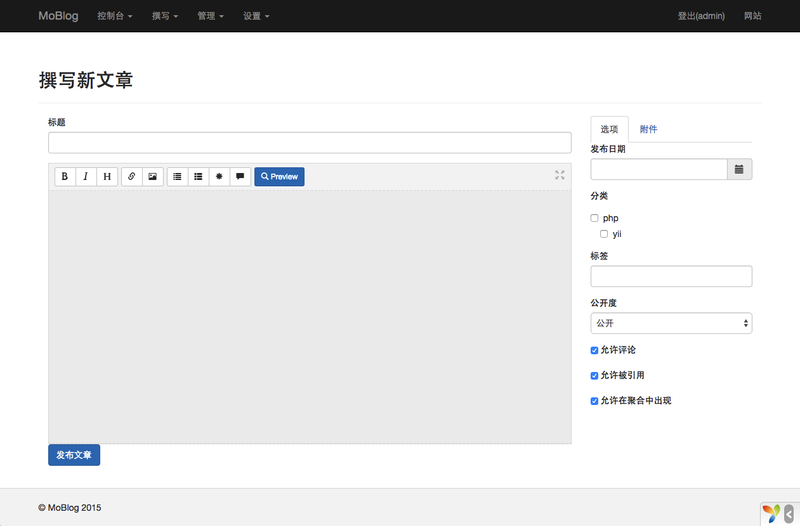

MoBlog
===================================
###截图###

###演示###

网址： [http://moblog.coding.io/](http://moblog.coding.io/)

###说明###

1.MoBlog是一个基于Yii2开发的博客系统，目前一些功能正在完善

2.数据库设计直接采用`typecho`的数据库结构，功能结构也是模仿`typecho`

3.为了部署到coding演示平台，省掉了yii命令部署方式

###安装###

1.下载或clone源码，运行`composer install`安装依赖

2.导入`common/data/blog.sql`文件到数据库,配置`common/config/main-local.php`文件中数据库组件

3.配置nginx或apache网站根目录到`web`文件夹

4.前台访问`index.php`文件，后台访问`admin.php`文件

5.后台账号`admin` 密码`123456`

###协议###

MIT

